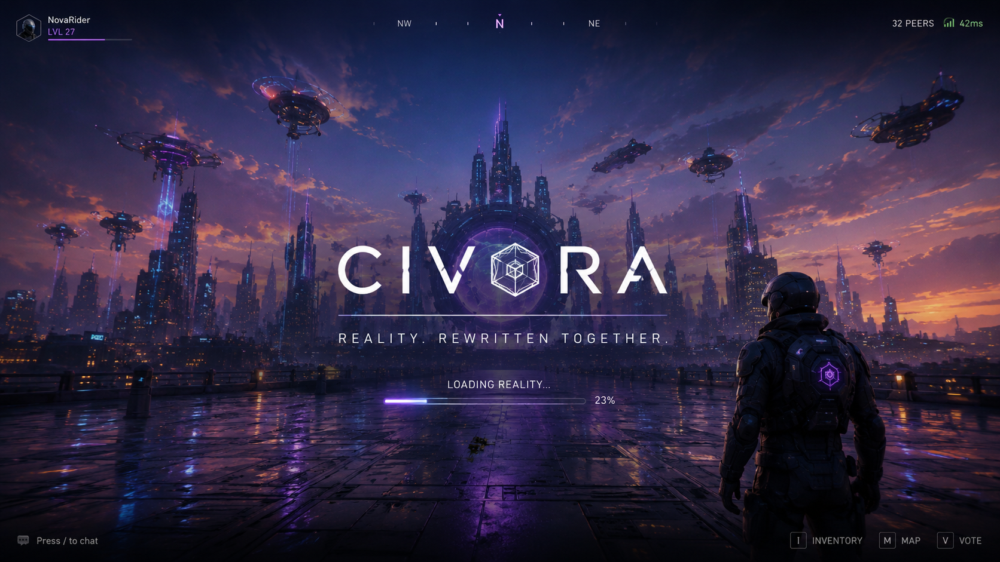
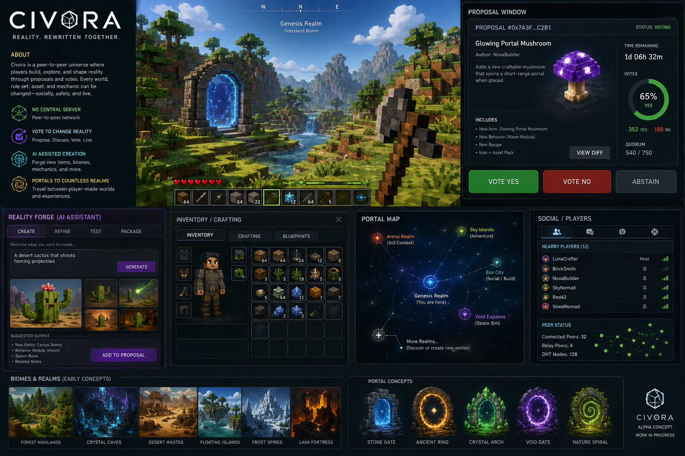
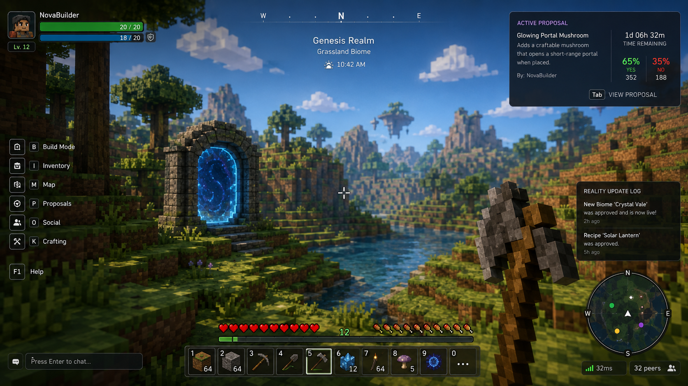
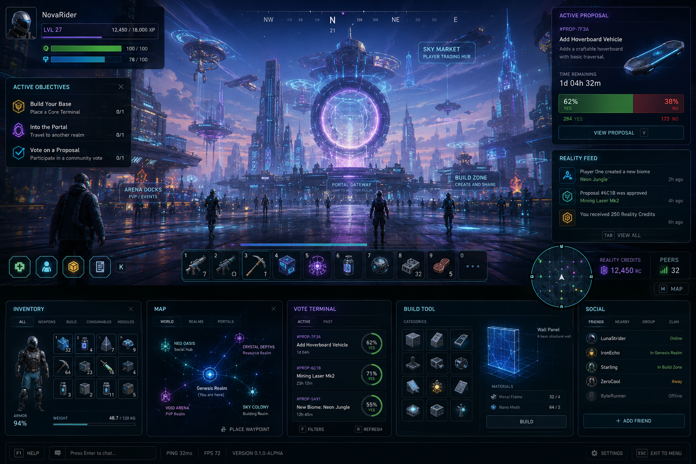
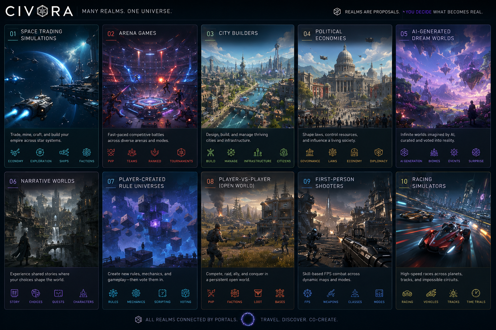
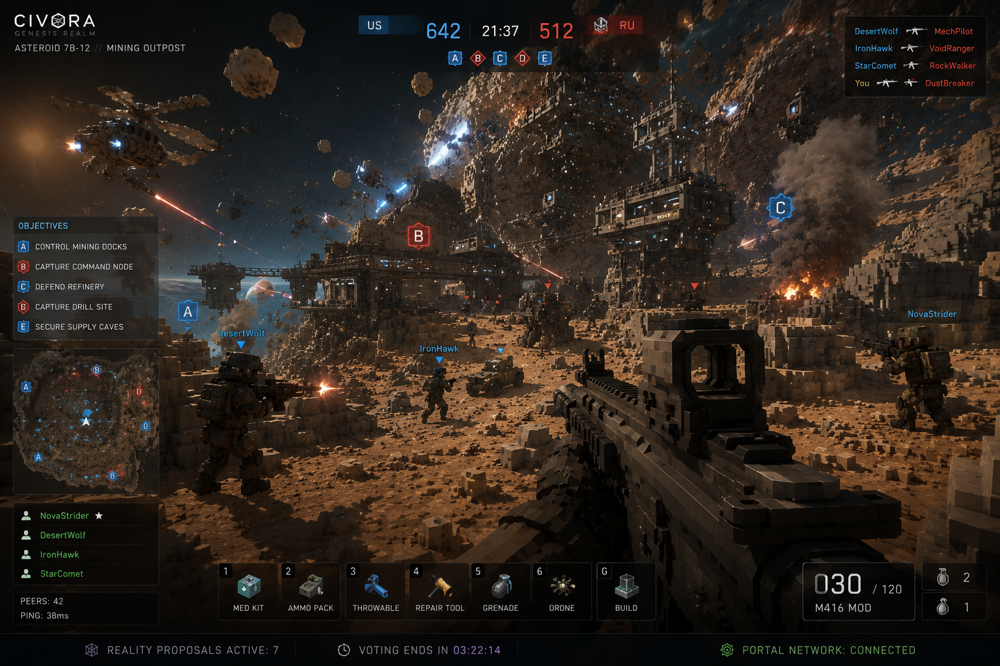
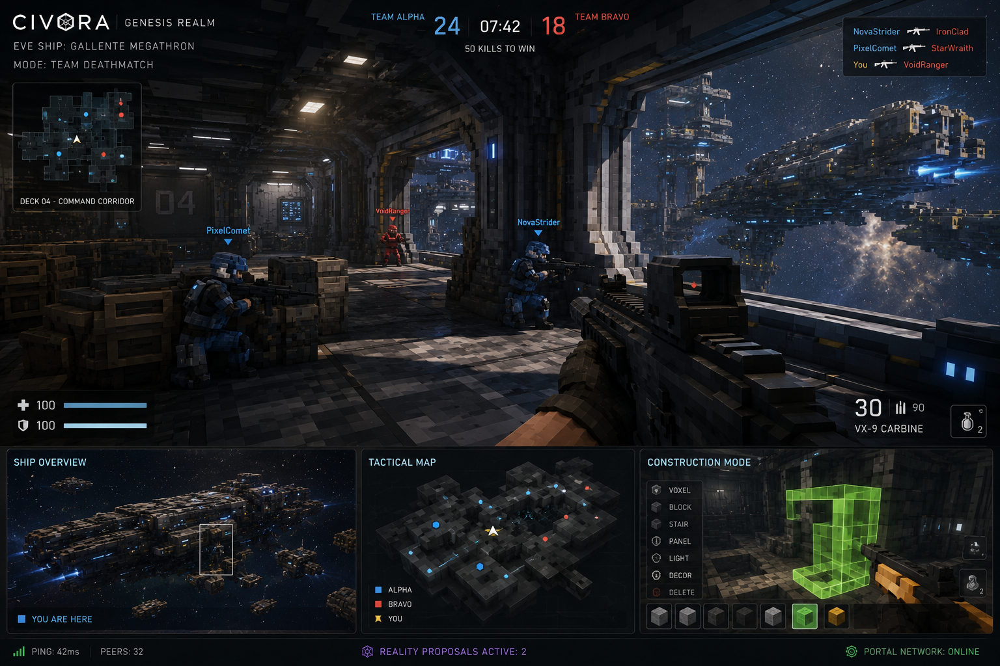
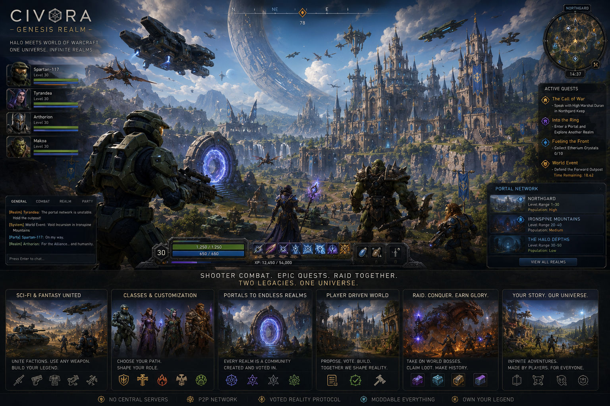
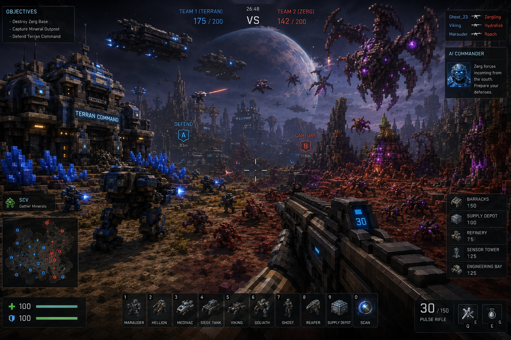
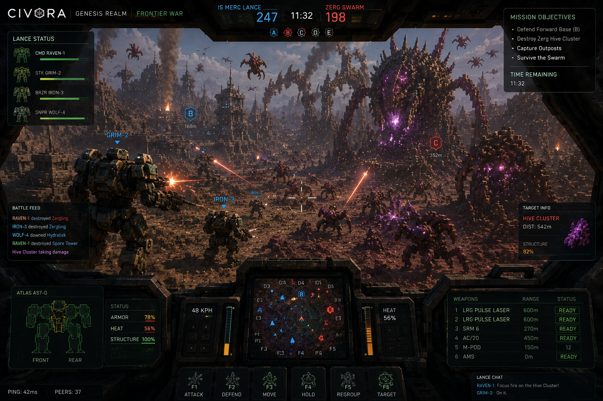

## Core concept
The initial game is Genesis Realm:

A shared voxel world where players can interact, build, explore, spawn 
AI-generated objects, propose rule changes, and open portals into other 
realms. A realm can be anything. A space-trading sim, arena shooter, 
city builder, or real-time political economy, but the first realm should 
be simple enough for 12 people to actually experiment.

## Artwork concepts

