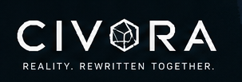

Build it as a game first, but architect it like a universe protocol. 
The first playable thing should be small and concrete: a peer-to-peer 
voxel survival/building world with portals, AI-assisted mod creation, 
and live community voting. The “universe” emerges when every world, 
rule set, asset pack, economy, and governance system is just another 
voted-in module.

The hard boundary: no authoritative game server, not “no infrastructure 
at all.” We will still need peer discovery, relays, content storage, 
and bootstrapping, but those should be community-run and replaceable, 
not owned by one company.

## Core concept
The initial game is Genesis Realm:

A shared voxel world where players can interact, build, explore, spawn 
AI-generated objects, propose rule changes, and open portals into other 
realms. A realm can be anything. A space-trading sim, arena shooter, 
city builder, or real-time political economy, but the first realm should 
be simple enough for 12 people to actually experiment.

The key rule is:
* Git commits do not directly change reality.
* Git commits become proposals.
* Proposals become reality only after signed player approval.

That keeps “anyone can push” alive without letting one malicious patch 
brick everyone’s client.


### Recommended stack
Use Rust as the primary language. The project needs a safe native client, 
a deterministic simulation core, peer-to-peer networking, sandboxed plugins, 
cryptographic signatures, and reproducible build tooling. Use Bevy for the 
initial engine because it is a Rust-native, open-source ECS game engine 
with cross-platform support and asset hot-reloading features. Bevy’s ECS 
model also maps well to “world rules as systems.”

Use WebAssembly for user-submitted gameplay code. Do not hot-patch arbitrary 
native code. Every community rule, item behavior, NPC behavior, portal rule, 
governance extension, or AI-generated mechanic should compile into a sandboxed 
Wasm module. WebAssembly’s security model is specifically built around isolating 
modules from the host runtime, and Wasmtime gives us a production-grade 
runtime for Wasm, WASI, and the Component Model.

Use WIT / WebAssembly Component Model for the plugin ABI. This lets us define 
stable interfaces like spawn_entity, read_voxel, emit_event, mint_item, cast_vote, 
and open_portal, while allowing modules to be written in Rust first and other 
languages later. The Component Model is designed for interoperable WebAssembly 
libraries, applications, and environments.

Use libp2p for networking. It is a modular peer-to-peer networking stack with 
transports such as TCP, QUIC, WebSocket, WebRTC, and WebTransport, which is 
exactly the kind of base layer we need for a no-authoritative-server 
multiplayer network.

Use content-addressed storage for patches, assets, and world snapshots. 
Every accepted commit should point to immutable content hashes. IPFS-style 
CIDs and Merkle DAGs are a good conceptual model: data is addressed by 
hash-derived identifiers rather than by mutable server locations.

Use CRDTs only where they fit: collaborative documents, build plans, 
low-stakes world editing, chat, map annotations, and social metadata. 
Do not use CRDTs as the whole real-time combat/physics system. Automerge 
is useful here because it is a local-first sync engine intended for 
multiplayer apps that work offline and prevent conflicts.

Use Bazel or Nix for reproducible builds. The system depends on different 
peers building the same source and getting the same artifact hashes. 
Bazel’s hermetic build model is relevant because it isolates builds 
from host-machine differences and pins toolchains/dependencies.

| Area                            | Language / tech                                                      |
| ------------------------------- | -------------------------------------------------------------------- |
| Engine kernel                   | Rust                                                                 |
| Game engine                     | Bevy / Rust                                                          |
| P2P networking                  | Rust + libp2p                                                        |
| User-submitted gameplay modules | Rust compiled to WebAssembly first                                   |
| Plugin ABI                      | WIT / WebAssembly Component Model                                    |
| Wasm runtime                    | Wasmtime                                                             |
| Shaders                         | WGSL                                                                 |
| local assistant UI              | Rust, but keep it outside the deterministic simulation               |
| Build system                    | Bazel or Nix                                                         |
| Asset format                    | glTF, PNG, KTX2, Ogg/Opus, voxel chunks                              |
| Source workflow                 | Git commits + signed proposal manifests                              |

### Layers
```
┌──────────────────────────────────────────────┐
│  Player Client                               │
│                                              │
│  Bevy Renderer / Input / Audio / UI          │
│  Voxel Realm / Portal Realm / Future Realms  │
├──────────────────────────────────────────────┤
│  Mutable Universe Layer                      │
│  - Wasm gameplay modules                     │
│  - Realm rules                               │
│  - Item definitions                          │
│  - Governance module                         │
│  - AI-generated content proposals            │
├──────────────────────────────────────────────┤
│  Reality Kernel                              │
│  - Wasm sandbox                              │
│  - Capability permissions                    │
│  - Deterministic scheduler                   │
│  - Patch loader / rollback                   │
│  - Signature verification                    │
├──────────────────────────────────────────────┤
│  P2P Protocol Layer                          │
│  - libp2p gossip                             │
│  - peer discovery                            │
│  - DHT / content lookup                      │
│  - vote broadcast                            │
│  - cell committees                           │
├──────────────────────────────────────────────┤
│  Local Data Layer                            │
│  - accepted proposal ledger                  │
│  - content-addressed assets                  │
│  - world snapshots                           │
│  - local player keys                         │
└──────────────────────────────────────────────┘
```

### Kernel
The Reality Kernel is the only thing we would not make freely hot-patchable at first. 
It should be tiny, audited, boring, and hard to change. Everything above it can be 
modified by vote: game rules, assets, portals, economics, crafting, AI tools, 
even governance. But the kernel must always verify signatures, enforce sandboxing, 
protect player keys, stop infinite loops, and allow rollback.

That is the difference between a self-evolving universe and a remote-code-execution disaster.

## Open contribution
Git as the authoring interface.

A player or AI agent creates a branch:
```
feature/add-floating-islands
```
Then the client packages the commit into a proposal manifest:
```
Proposal {
  proposal_id
  author_public_key
  git_commit_hash
  source_bundle_cid
  build_manifest_cid
  wasm_module_cids
  asset_cids
  migration_cids
  governance_change: optional
  test_results_cid
  activation_epoch
  rollback_plan
}
```
The proposal is broadcast over the P2P network. Other clients fetch the source and 
artifacts by content hash, verify the build, run local tests, show the diff to players, 
and ask for a vote.

A commit becomes real only when the current governance rule produces a valid finality 
certificate:
```
FinalityCertificate {
  proposal_id
  governance_rule_version
  eligible_roster_root
  yes_signatures
  no_signatures
  quorum_result
  accepted_epoch
}
```
Every client follows the accepted ledger. If your client sees a valid finality certificate, 
it downloads the content pack, verifies it, and loads it at the next safe patch boundary.

## Voting
A proposal passes if more than 50% of currently eligible online players vote yes during 
the voting window, with a minimum quorum.

For the first alpha, “eligible” should mean:

1. The player has a valid identity key.
2. The player has joined the world before the proposal opened.
3. The player is online or recently active during the vote epoch.
4. The player is not a newly created untrusted identity.

Do not start with pure token-weighted voting. That turns the universe into plutocracy 
before you have culture, identity, anti-Sybil protection, or social legitimacy.

Use tokens first as AI / compute / proposal credits, not as the main political power.

### Initial voting rules
| Change type                 | Requirement                       |
| --------------------------- | --------------------------------- |
| Asset-only patch            | Simple majority                   |
| New item / creature / biome | Simple majority + automated tests |
| Gameplay code patch         | Majority + sandbox validation     |
| Economy change              | Higher quorum                     |
| Governance change           | Higher quorum + activation delay  |
| Kernel change               | Not in-game hot patch for v1      |

The governance module itself can be changed by vote, but the first governance rule should 
require an activation delay. That gives players time to inspect, fork, or reject a 
hostile rule change.

## Hot patching
Hot patch at epoch boundaries, not instantly in the middle of simulation.
```
12:00:00 - Proposal accepted
12:00:10 - Clients fetch patch
12:00:20 - Clients verify signatures and content hashes
12:00:30 - Clients run migration dry-run
12:01:00 - Patch activates at epoch 184220
12:01:01 - New rules live
```

| Patch type      | Example                                             | Hot-patch difficulty        |
| --------------- | --------------------------------------------------- | --------------------------- |
| Asset patch     | New texture, mesh, sound, biome config              | Easy                        |
| Data patch      | New item stats, recipes, spawn tables               | Medium                      |
| Wasm rule patch | New physics behavior, AI NPC logic, governance rule | Hard but doable             |
| Kernel patch    | Networking, sandbox, signature verifier             | Do not auto-hot-patch in v1 |


Every patch needs a rollback plan. If a migration corrupts a realm, 
clients should return to the last signed snapshot.

## Multiplayer 
We cannot make one global real-time simulation where every player validates every tick. 
That will collapse. Use realm + cell partitioning. 

### A realm is a rule universe.
Each realm has: 
```
RealmManifest {
  realm_id
  rule_modules
  physics_profile
  asset_pack
  portal_interfaces
  economy_rules
  governance_scope
}
```

### Cell
A cell is a local simulation area inside a realm.

In one realm, a cell might be a chunk group. 
In another realm, it might be a star system. 
In some realms, it might be a match.

Each cell is maintained by a temporary peer committee:
```
CellCommittee {
  cell_id
  members
  current_tick
  signed_snapshot_hash
  action_log_hash
}
```

The committee validates actions, gossips signed state updates, and periodically publishes 
snapshots. If peers leave, the committee rotates.

This is “no central server,” but not “no authority.” Authority is temporary, local, 
distributed, auditable, and replaceable.

## World-state
Use different synchronization models for different kinds of state.
This avoids forcing one distributed-systems model to solve every problem:
| State type                 | Model                                        |
| -------------------------- | -------------------------------------------- |
| Player movement            | Prediction + rollback / reconciliation       |
| Combat                     | Deterministic tick simulation inside a cell  |
| Voxel edits                | Signed action log + periodic snapshots       |
| Large collaborative builds | CRDT-assisted editing                        |
| Economy transactions       | Ledger transactions                          |
| Governance votes           | Signed append-only ledger                    |
| Portals                    | Cross-realm transaction receipts             |
| Chat / notes / map labels  | CRDT/local-first sync                        |
| AI proposals               | Git commit + content-addressed artifact pack |

## Portals
A portal is not just a door. It is a protocol bridge.
Each realm exposes an avatar import/export interface:
```
export_avatar(player_id) -> AvatarState
import_avatar(AvatarState, PortalTicket) -> SpawnResult
```

A portal transaction says:
```
Player A leaves Genesis Voxel Realm at portal P.
Inventory subset X is locked or transformed.
Avatar state is exported.
Destination realm accepts compatible state.
Player appears in Space Realm.
```

Not every object should transfer. A diamond pickaxe may become raw mass, trade credit, 
or nothing in a space realm. Each portal defines conversion rules.

This lets you connect Minecraft-like, EVE-like, and bizarre AI-generated realms without 
pretending they all share identical physics.

## Making reality
Give every player an in-game tool called something like "Reality Forge".
A player prompts their AI agent, it produces:
```
- biome config
- voxel palette
- item definitions
- optional Wasm rule module
- tests
- preview realm
- proposal summary
```

The player tests it privately. Then they submit it as a signed proposal.

| AI use                   | Example                              |
| ------------------------ | ------------------------------------ |
| Generate assets          | Textures, models, sounds             |
| Generate code            | Wasm module drafts                   |
| Run simulations          | Balance testing                      |
| Spawn private test realm | Preview before proposing             |
| Submit proposal          | Anti-spam deposit                    |

### Reputation
Non-transferable. Used for trust, moderation weight, anti-spam, and committee selection.
Do not let reputation be sold. 
The universe needs identity and trust more than it needs speculation.